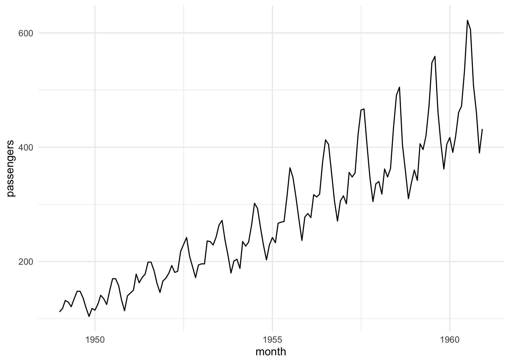

# mlr3forecast

Extending mlr3 to time series forecasting.

<!-- badges: start -->

[](https://lifecycle.r-lib.org/articles/stages.html#experimental)
[](https://github.com/mlr-org/mlr3forecast/actions/workflows/rcmdcheck.yaml)
[](https://CRAN.R-project.org/package=mlr3forecast)
[](https://stackoverflow.com/questions/tagged/mlr3)
[](https://lmmisld-lmu-stats-slds.srv.mwn.de/mlr_invite/)
<!-- badges: end -->

> This package is in an early stage of development and should be
> considered experimental. If you are interested in experimenting with
> it, we welcome your feedback!

## Installation

Install the development version from [GitHub](https://github.com/):

``` r
# install.packages("pak")
pak::pak("mlr-org/mlr3forecast")
```

## Usage

The goal of mlr3forecast is to extend mlr3 to time series forecasting.
This is achieved by introducing new classes and methods for forecasting
tasks, learners, and resamplers. For now the forecasting task and
learner is restricted to time series regression tasks, but might be
extended to classification tasks in the future.

We have two goals, one to support traditional forecasting learners and
the other to support machine learning forecasting, i.e. using regression
learners and applying them to forecasting tasks. The design of the
latter is still in flux and may change.

### Example: forecasting with forecast learner

Currently, we support native forecasting learners from the forecast and
smooth packages. In the future, we plan to support more learners.

``` r
library(mlr3forecast)

task = tsk("airpassengers")
task
#> 
#> ── <TaskFcst> (144x1): Monthly Airline Passenger Numbers 1949-1960 ─────────────
#> • Target: passengers
#> • Properties: ordered
#> • Order by: month
#> • Frequency: monthly

# or plot the task
autoplot(task)
```



``` r

learner = lrn("fcst.auto_arima")$train(task)
prediction = learner$predict(task, 140:144)
prediction
#> 
#> ── <PredictionRegr> for 5 observations: ────────────────────────────────────────
#>  row_ids truth response
#>      140   606 623.9219
#>      141   508 513.8585
#>      142   461 450.7762
#>      143   390 410.8961
#>      144   432 439.9462
prediction$score(msr("regr.rmse"))
#> regr.rmse 
#>  13.85518

# currently there is no specialized prediction object
# for now you can do the following to add the order column to the prediction
tab = as.data.table(prediction)
tab = tab[task$order, on = .(row_ids = row_id), nomatch = NULL]
setcolorder(tab, c("row_ids", "order"))
tab
#>    row_ids      order truth response
#> 1:     140 1960-08-01   606 623.9219
#> 2:     141 1960-09-01   508 513.8585
#> 3:     142 1960-10-01   461 450.7762
#> 4:     143 1960-11-01   390 410.8961
#> 5:     144 1960-12-01   432 439.9462

# generate new data to forecast unseen data
newdata = generate_newdata(task, 12L)
newdata
#>          month passengers
#>  1: 1961-01-01         NA
#>  2: 1961-02-01         NA
#>  3: 1961-03-01         NA
#>  4: 1961-04-01         NA
#>  5: 1961-05-01         NA
#>  6: 1961-06-01         NA
#>  7: 1961-07-01         NA
#>  8: 1961-08-01         NA
#>  9: 1961-09-01         NA
#> 10: 1961-10-01         NA
#> 11: 1961-11-01         NA
#> 12: 1961-12-01         NA
prediction = learner$predict_newdata(newdata, task)
prediction
#> 
#> ── <PredictionRegr> for 12 observations: ───────────────────────────────────────
#>  row_ids truth response
#>        1    NA 445.6351
#>        2    NA 420.3953
#>        3    NA 449.1988
#>      ---   ---      ---
#>       10    NA 494.1275
#>       11    NA 423.3336
#>       12    NA 465.5085

# add the order column to the prediction
tab = as.data.table(prediction)
tab[, order := newdata[, month]]
setcolorder(tab, c("row_ids", "order"))
tab
#>     row_ids      order truth response
#>  1:       1 1961-01-01    NA 445.6351
#>  2:       2 1961-02-01    NA 420.3953
#>  3:       3 1961-03-01    NA 449.1988
#>  4:       4 1961-04-01    NA 491.8405
#>  5:       5 1961-05-01    NA 503.3951
#>  6:       6 1961-06-01    NA 566.8632
#>  7:       7 1961-07-01    NA 654.2610
#>  8:       8 1961-08-01    NA 638.5983
#>  9:       9 1961-09-01    NA 540.8846
#> 10:      10 1961-10-01    NA 494.1275
#> 11:      11 1961-11-01    NA 423.3336
#> 12:      12 1961-12-01    NA 465.5085

# works with quantile response
learner = lrn(
  "fcst.auto_arima",
  predict_type = "quantiles",
  quantiles = c(0.1, 0.15, 0.5, 0.85, 0.9),
  quantile_response = 0.5
)$train(task)
learner$predict_newdata(newdata, task)
#> 
#> ── <PredictionRegr> for 12 observations: ───────────────────────────────────────
#>  row_ids truth     q0.1    q0.15     q0.5    q0.85     q0.9 response
#>        1    NA 430.8905 433.7106 445.6351 457.5595 460.3796 445.6351
#>        2    NA 403.0907 406.4005 420.3953 434.3901 437.6999 420.3953
#>        3    NA 429.7726 433.4882 449.1988 464.9093 468.6249 449.1988
#>      ---   ---      ---      ---      ---      ---      ---      ---
#>       10    NA 469.8626 474.5036 494.1275 513.7514 518.3925 494.1275
#>       11    NA 398.8383 403.5234 423.3336 443.1438 447.8290 423.3336
#>       12    NA 440.8230 445.5445 465.5085 485.4725 490.1940 465.5085
```

### Example: forecasting with regression learner

``` r
library(mlr3learners)

task = tsk("airpassengers")
learner = lrn("regr.ranger")
flrn = ForecastLearner$new(learner, lags = 1:12)$train(task)
newdata = generate_newdata(task, 12L)
prediction = flrn$predict_newdata(newdata, task)
prediction
#> 
#> ── <PredictionRegr> for 12 observations: ───────────────────────────────────────
#>  row_ids truth response
#>        1    NA 436.5747
#>        2    NA 439.6728
#>        3    NA 457.9363
#>      ---   ---      ---
#>       10    NA 469.7243
#>       11    NA 441.8082
#>       12    NA 441.3008
prediction = flrn$predict(task, 140:144)
prediction
#> 
#> ── <PredictionRegr> for 5 observations: ────────────────────────────────────────
#>  row_ids truth response
#>        1   606 580.0478
#>        2   508 499.9251
#>        3   461 457.9081
#>        4   390 413.8414
#>        5   432 435.7325
prediction$score(msr("regr.rmse"))
#> regr.rmse 
#>  16.31335

flrn = ForecastLearner$new(learner, lags = 1:12)
resampling = rsmp("fcst.holdout", ratio = 0.9)
rr = resample(task, flrn, resampling)
rr$aggregate(msr("regr.rmse"))
#> regr.rmse 
#>  48.50939

resampling = rsmp("fcst.cv")
rr = resample(task, flrn, resampling)
rr$aggregate(msr("regr.rmse"))
#> regr.rmse 
#>  25.09395
```

Or with some feature engineering using mlr3pipelines:

``` r
library(mlr3pipelines)

graph = ppl("convert_types", "Date", "POSIXct") %>>%
  po(
    "datefeatures",
    param_vals = list(
      week_of_year = FALSE,
      day_of_year = FALSE,
      day_of_month = FALSE,
      day_of_week = FALSE,
      is_day = FALSE,
      hour = FALSE,
      minute = FALSE,
      second = FALSE
    )
  )
task = tsk("airpassengers")
task$set_col_roles("month", add = "feature")
flrn = ForecastLearner$new(lrn("regr.ranger"), lags = 1:12)
glrn = as_learner(graph %>>% flrn)$train(task)
prediction = glrn$predict(task, 142:144)
prediction$score(msr("regr.rmse"))
#> regr.rmse 
#>   13.5053
```

### Example: forecasting electricity demand

``` r
library(mlr3learners)
library(mlr3pipelines)

task = tsk("electricity")
task$set_col_roles("date", add = "feature")
graph = ppl("convert_types", "Date", "POSIXct") %>>%
  po(
    "datefeatures",
    param_vals = list(
      year = FALSE,
      is_day = FALSE,
      hour = FALSE,
      minute = FALSE,
      second = FALSE
    )
  )
flrn = ForecastLearner$new(lrn("regr.ranger"), 1:3)
glrn = as_learner(graph %>>% flrn)$train(task)

max_date = task$data()[.N, date]
newdata = data.frame(
  date = max_date + 1:14,
  demand = rep(NA_real_, 14L),
  temperature = 26,
  holiday = c(TRUE, rep(FALSE, 13L))
)
prediction = glrn$predict_newdata(newdata, task)
prediction
#> 
#> ── <PredictionRegr> for 14 observations: ───────────────────────────────────────
#>  row_ids truth response
#>        1    NA 187107.5
#>        2    NA 198215.1
#>        3    NA 187428.4
#>      ---   ---      ---
#>       12    NA 221015.6
#>       13    NA 224586.3
#>       14    NA 226395.9
```

### Example: global forecasting (longitudinal data)

``` r
library(mlr3learners)
library(mlr3pipelines)
library(tsibble)

task = tsibbledata::aus_livestock |>
  as.data.table() |>
  setnames(tolower) |>
  _[, month := as.Date(month)] |>
  _[, .(count = sum(count)), by = .(state, month)] |>
  setorder(state, month) |>
  as_task_fcst(
    id = "aus_livestock",
    target = "count",
    order = "month",
    key = "state",
    freq = "monthly"
  )
task$set_col_roles("month", add = "feature")

graph = ppl("convert_types", "Date", "POSIXct") %>>%
  po(
    "datefeatures",
    param_vals = list(
      week_of_year = FALSE,
      day_of_week = FALSE,
      day_of_month = FALSE,
      day_of_year = FALSE,
      is_day = FALSE,
      hour = FALSE,
      minute = FALSE,
      second = FALSE
    )
  )
task = graph$train(task)[[1L]]

flrn = ForecastLearner$new(lrn("regr.ranger"), 1:3)$train(task)
prediction = flrn$predict(task, 4460:4464)
prediction$score(msr("regr.rmse"))
#> regr.rmse 
#>  23123.15

flrn = ForecastLearner$new(lrn("regr.ranger"), 1:3)
resampling = rsmp("fcst.holdout", ratio = 0.9)
rr = resample(task, flrn, resampling)
rr$aggregate(msr("regr.rmse"))
#> regr.rmse 
#>  30197.14
```

### Example: global vs local forecasting

In machine learning forecasting the difference between forecasting a
time series and longitudinal data is often refered to local and global
forecasting.

``` r
# TODO: find better task example, since the effect is minor here

graph = ppl("convert_types", "Date", "POSIXct") %>>%
  po(
    "datefeatures",
    param_vals = list(
      week_of_year = FALSE,
      day_of_week = FALSE,
      day_of_month = FALSE,
      day_of_year = FALSE,
      is_day = FALSE,
      hour = FALSE,
      minute = FALSE,
      second = FALSE
    )
  )

# local forecasting
task = tsibbledata::aus_livestock |>
  as.data.table() |>
  setnames(tolower) |>
  _[, month := as.Date(month)] |>
  _[state == "Western Australia", .(count = sum(count)), by = .(month)] |>
  setorder(month) |>
  as_task_fcst(id = "aus_livestock", target = "count", order = "month")
task = graph$train(task)[[1L]]
flrn = ForecastLearner$new(lrn("regr.ranger"), 1L)$train(task)
dt = task$backend$data(
  rows = task$row_ids,
  cols = c(task$backend$primary_key, "month.year")
)
setnames(dt, c("row_id", "year"))
row_ids = dt[year >= 2015, row_id]
prediction = flrn$predict(task, row_ids)
prediction$score(msr("regr.rmse"))

# global forecasting
task = tsibbledata::aus_livestock |>
  as.data.table() |>
  setnames(tolower) |>
  _[, month := as.Date(month)] |>
  _[, .(count = sum(count)), by = .(state, month)] |>
  setorder(state, month) |>
  as_task_fcst(id = "aus_livestock", target = "count", order = "month", key = "state")
task = graph$train(task)[[1L]]
task$col_roles$key = "state"
flrn = ForecastLearner$new(lrn("regr.ranger"), 1L)$train(task)
dt = task$backend$data(
  rows = task$row_ids,
  cols = c(task$backend$primary_key, "month.year", "state")
)
setnames(dt, c("row_id", "year", "state"))
row_ids = dt[year >= 2015 & state == "Western Australia", row_id]
prediction = flrn$predict(task, row_ids)
prediction$score(msr("regr.rmse"))
```

### Example: Custom PipeOps

``` r
library(mlr3learners)
library(mlr3pipelines)

task = tsk("airpassengers")
pop = po("fcst.lag", lags = 1:12)
new_task = pop$train(list(task))[[1L]]
new_task$data()

task = tsk("airpassengers")
graph = po("fcst.lag", lags = 1:12) %>>%
  ppl("convert_types", "Date", "POSIXct") %>>%
  po(
    "datefeatures",
    param_vals = list(
      week_of_year = FALSE,
      day_of_week = FALSE,
      day_of_month = FALSE,
      day_of_year = FALSE,
      is_day = FALSE,
      hour = FALSE,
      minute = FALSE,
      second = FALSE
    )
  )
flrn = ForecastLearnerManual$new(lrn("regr.ranger"))
glrn = as_learner(graph %>>% flrn)$train(task)
prediction = glrn$predict(task, 142:144)
prediction$score(msr("regr.rmse"))

newdata = generate_newdata(task, 12L)
glrn$predict_newdata(newdata, task)
```

### Example: common target transformations

Some common target transformations in forecasting are:

- differencing (WIP)
- log transformation, see example below
- power transformations such as
  [Box-Cox](https://mlr3pipelines.mlr-org.com/reference/mlr_pipeops_boxcox.html)
  and
  [Yeo-Johnson](https://mlr3pipelines.mlr-org.com/reference/mlr_pipeops_yeojohnson.html)
  currently only supported as feature transformation and not target
- scaling/normalization, available see
  [here](https://mlr3pipelines.mlr-org.com/reference/mlr_pipeops_targettrafoscalerange.html)

``` r
trafo = po(
  "targetmutate",
  param_vals = list(
    trafo = function(x) log(x),
    inverter = function(x) list(response = exp(x$response))
  )
)

graph = po("fcst.lag", lags = 1:12) %>>%
  ppl("convert_types", "Date", "POSIXct") %>>%
  po(
    "datefeatures",
    param_vals = list(
      week_of_year = FALSE,
      day_of_week = FALSE,
      day_of_month = FALSE,
      day_of_year = FALSE,
      is_day = FALSE,
      hour = FALSE,
      minute = FALSE,
      second = FALSE
    )
  )

task = tsk("airpassengers")
flrn = ForecastLearnerManual$new(lrn("regr.ranger"))
glrn = as_learner(graph %>>% flrn)
pipeline = ppl("targettrafo", graph = glrn, trafo_pipeop = trafo)
glrn = as_learner(pipeline)$train(task)
prediction = glrn$predict(task, 142:144)
prediction$score(msr("regr.rmse"))
```

``` r
graph = po("fcst.lag", lags = 1:12) %>>%
  ppl("convert_types", "Date", "POSIXct") %>>%
  po(
    "datefeatures",
    param_vals = list(
      week_of_year = FALSE,
      day_of_week = FALSE,
      day_of_month = FALSE,
      day_of_year = FALSE,
      is_day = FALSE,
      hour = FALSE,
      minute = FALSE,
      second = FALSE
    )
  )

task = tsk("airpassengers")
flrn = ForecastLearnerManual$new(lrn("regr.ranger"))
glrn = as_learner(graph %>>% flrn)
trafo = po("fcst.targetdiff", lags = 12L)
pipeline = ppl("targettrafo", graph = glrn, trafo_pipeop = trafo)
glrn = as_learner(pipeline)$train(task)
prediction = glrn$predict(task, 142:144)
prediction$score(msr("regr.rmse"))
```
