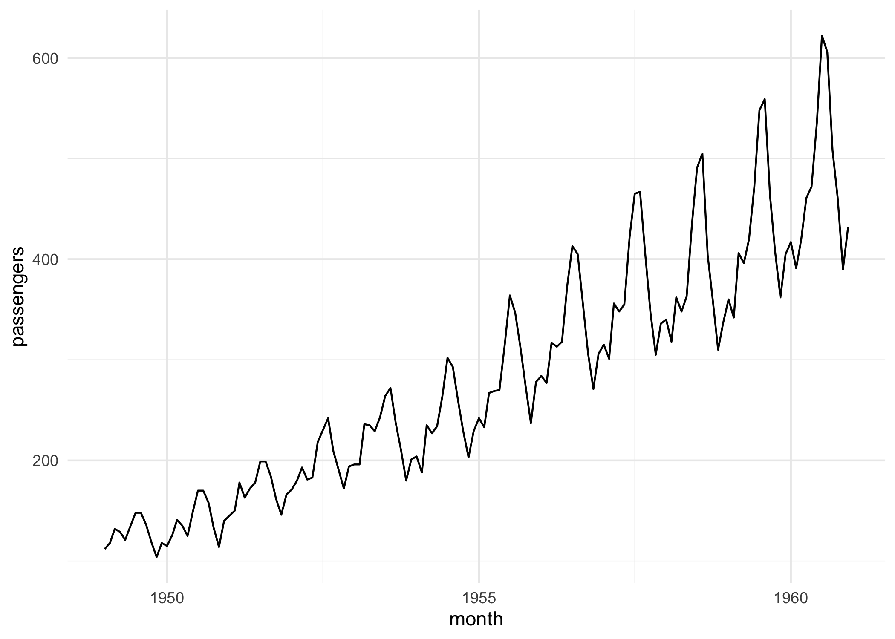
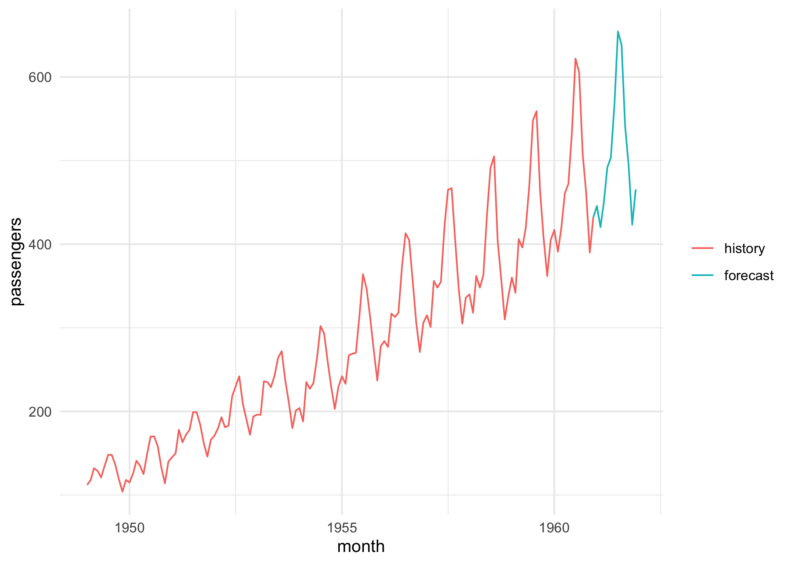

# mlr3forecast

Extending mlr3 to time series forecasting.

<!-- badges: start -->

[](https://lifecycle.r-lib.org/articles/stages.html#experimental)
[](https://github.com/mlr-org/mlr3forecast/actions/workflows/rcmdcheck.yaml)
[](https://stackoverflow.com/questions/tagged/mlr3)
[](https://lmmisld-lmu-stats-slds.srv.mwn.de/mlr_invite/)
<!-- badges: end -->

> This package is in an early stage of development and should be
> considered experimental. If you are interested in experimenting with
> it, we welcome your feedback!

## Installation

Install the development version from [GitHub](https://github.com/):

``` r
# install.packages("pak")
pak::pak("mlr-org/mlr3forecast")
```

## Usage

mlr3forecast extends the [mlr3](https://mlr-org.com/) ecosystem to time
series forecasting. It introduces a forecasting task, forecasting
learners, temporal resampling strategies, forecasting measures, and
feature-engineering pipe operators, so that forecasters behave like any
other mlr3 learner — ready for tuning, benchmarking, pipelines, and
ensembling.

At a glance, mlr3forecast provides:

- **Classical forecasters** wrapping forecast, smooth, prophet, and
  tscount — over 30 in total, from baselines (`fcst.mean`,
  `fcst.random_walk`) to ARIMA (`fcst.auto_arima`), ETS, theta, TBATS,
  prophet, neural nets (`fcst.nnetar`), and count models
  (`fcst.tscount`). See `mlr_learners$keys("^fcst")` for the full list.

- **Machine learning forecasting** that turns any `regr` learner into a
  forecaster via lag features, with both **recursive** (one model
  applied iteratively) and **direct** (one model per horizon)
  strategies.

- **Forecasting tasks and temporal resamplings** (`fcst.holdout`,
  `fcst.cv`) that respect the order of observations, plus global
  (longitudinal) forecasting across many series.

- **Feature-engineering pipe operators** such as `fcst.lags`,
  `fcst.rolling`, `fcst.fourier`, `fcst.feasts`, and `fcst.tsfeats`.

- **Forecasting measures** including MASE, RMSSE, Pinball, Winkler,
  coverage, and MSIS (see `mlr_measures$keys("^fcst")` for the full
  list).

- **Full mlr3 integration**: tuning with mlr3tuning, benchmarking,
  target transformations, and ensembling with mlr3pipelines.

- **Example tasks** to get started — `airpassengers`, `electricity`,
  `livestock`, `lynx`, and `usaccdeaths`. List them with
  `as.data.table(mlr_tasks)[task_type == "fcst"]`.

For now the forecasting task and learner are restricted to time series
regression, but may be extended to classification in the future.

Jump to the examples for:

- [Classical forecasters](#classical-forecasters)
- [Machine learning forecasters](#machine-learning-forecasters)
- [Benchmarking, ensembling, and
  tuning](#benchmarking-ensembling-and-tuning)
- [Global forecasting](#global-forecasting)

### Classical forecasters

Native forecasting learners are provided by packages such as forecast,
smooth, prophet, and tscount.

``` r
library(mlr3forecast)
library(mlr3pipelines)
library(ggplot2)

task = tsk("airpassengers")
task
#> 
#> ── <TaskFcst> (144x1): Monthly Airline Passenger Numbers 1949-1960 ─────────────
#> • Target: passengers
#> • Properties: ordered
#> • Order by: month
#> • Frequency: month

# or plot the task
autoplot(task)
```



``` r

# train a forecast learner
learner = lrn("fcst.auto_arima")$train(task)
prediction = learner$predict(task, 140:144)
prediction
#> 
#> ── <PredictionFcst> for 5 observations: ────────────────────────────────────────
#>       month row_ids truth response
#>  1960-08-01     140   606 623.9219
#>  1960-09-01     141   508 513.8585
#>  1960-10-01     142   461 450.7762
#>  1960-11-01     143   390 410.8961
#>  1960-12-01     144   432 439.9462
prediction$score(msr("regr.rmse"))
#> regr.rmse 
#>  13.85518
```

To forecast beyond the observed data, `generate_newdata()` builds the
future rows (with missing targets) and `predict_newdata()` fills them
in:

``` r
# generate new data to forecast unseen data
newdata = generate_newdata(task, 12L)
head(newdata)
#>         month passengers
#> 1: 1961-01-01         NA
#> 2: 1961-02-01         NA
#> 3: 1961-03-01         NA
#> 4: 1961-04-01         NA
#> 5: 1961-05-01         NA
#> 6: 1961-06-01         NA
prediction = learner$predict_newdata(newdata, task)
prediction
#> 
#> ── <PredictionFcst> for 12 observations: ───────────────────────────────────────
#>       month row_ids truth response
#>  1961-01-01       1    NA 445.6351
#>  1961-02-01       2    NA 420.3953
#>  1961-03-01       3    NA 449.1988
#>         ---     ---   ---      ---
#>  1961-10-01      10    NA 494.1275
#>  1961-11-01      11    NA 423.3336
#>  1961-12-01      12    NA 465.5085
```

The `forecast()` helper combines these two steps, generating the future
rows and predicting them in a single call:

``` r
prediction = forecast(learner, task, 12L)
prediction
#> 
#> ── <PredictionFcst> for 12 observations: ───────────────────────────────────────
#>       month row_ids truth response
#>  1961-01-01       1    NA 445.6351
#>  1961-02-01       2    NA 420.3953
#>  1961-03-01       3    NA 449.1988
#>         ---     ---   ---      ---
#>  1961-10-01      10    NA 494.1275
#>  1961-11-01      11    NA 423.3336
#>  1961-12-01      12    NA 465.5085
```

The resulting
[`PredictionFcst`](https://mlr-org.github.io/mlr3forecast/reference/PredictionFcst.html)
can be plotted with `autoplot()`, overlaying the forecast on the
historical series:

``` r
autoplot(prediction, task)
```



Target transformations can be applied by wrapping the learner in
`ppl("targettrafo")`:

``` r
# add a target log transformation
learner = as_learner(ppl(
  "targettrafo",
  graph = lrn("fcst.auto_arima"),
  targetmutate.trafo = function(x) log(x),
  targetmutate.inverter = function(x) list(response = exp(x$response))
))
prediction = learner$train(task)$predict(task, 140:144)
prediction$score(msr("regr.rmse"))
#> regr.rmse 
#>  12.29896
```

Which predict types a learner supports (e.g. `"quantiles"`, `"se"`) is
listed in its `predict_types`:

``` r
lrn("fcst.auto_arima")$predict_types
#> [1] "response"  "quantiles"
```

Classical forecasters can then return a predictive distribution as
quantiles, scored with probabilistic measures such as the Pinball loss:

``` r
# works with quantile response
learner = lrn(
  "fcst.auto_arima",
  predict_type = "quantiles",
  quantiles = c(0.1, 0.15, 0.5, 0.85, 0.9),
  quantile_response = 0.5
)$train(task, 1:132)
learner$predict_newdata(newdata, task)
#> 
#> ── <PredictionFcst> for 12 observations: ───────────────────────────────────────
#>       month row_ids truth     q0.1    q0.15     q0.5    q0.85     q0.9 response
#>  1961-01-01       1    NA 410.6811 413.2496 424.1099 434.9702 437.5387 424.1099
#>  1961-02-01       2    NA 390.2142 393.4355 407.0557 420.6759 423.8972 407.0557
#>  1961-03-01       3    NA 450.7334 454.5764 470.8257 487.0751 490.9181 470.8257
#>         ---     ---   ---      ---      ---      ---      ---      ---      ---
#>  1961-10-01      10    NA 436.9438 443.6242 471.8707 500.1173 506.7976 471.8707
#>  1961-11-01      11    NA 390.3115 397.3040 426.8707 456.4374 463.4300 426.8707
#>  1961-12-01      12    NA 431.7490 439.0404 469.8707 500.7011 507.9925 469.8707
learner$predict(task, 133:144)$score(msr("fcst.pinball"))
#> fcst.pinball 
#>     11.38111
```

Forecasting resamplings respect the temporal order of the observations:

``` r
# resampling, scored with a forecasting measure (MASE)
learner = lrn("fcst.auto_arima")
resampling = rsmp("fcst.holdout", ratio = 0.7)
rr = resample(task, learner, resampling)
rr$aggregate(msrs(c("regr.rmse", "fcst.mase")))
#> regr.rmse fcst.mase 
#> 27.121096  1.212049
```

### Machine learning forecasters

Any regression learner can be turned into a forecaster with
`recursive_forecaster()`, which adds lag features and forecasts
recursively:

``` r
library(mlr3learners)

task = tsk("airpassengers")
learner = lrn("regr.ranger")
flrn = recursive_forecaster(learner, lags = 1:12)$train(task)
newdata = generate_newdata(task, 12L)
prediction = flrn$predict_newdata(newdata, task)
prediction
#> 
#> ── <PredictionRegr> for 12 observations: ───────────────────────────────────────
#>  row_ids truth response      month
#>        1    NA 443.3377 1961-01-01
#>        2    NA 447.6441 1961-02-01
#>        3    NA 466.9256 1961-03-01
#>      ---   ---      ---        ---
#>       10    NA 491.5364 1961-10-01
#>       11    NA 454.0612 1961-11-01
#>       12    NA 457.0454 1961-12-01
prediction = flrn$predict(task, 140:144)
prediction
#> 
#> ── <PredictionRegr> for 5 observations: ────────────────────────────────────────
#>  row_ids truth response      month
#>      140   606 567.9797 1960-08-01
#>      141   508 507.3734 1960-09-01
#>      142   461 459.6002 1960-10-01
#>      143   390 416.4148 1960-11-01
#>      144   432 435.7832 1960-12-01
prediction$score(msr("regr.rmse"))
#> regr.rmse 
#>  20.78437

flrn = recursive_forecaster(learner, lags = 1:12)
resampling = rsmp("fcst.holdout", ratio = 0.9)
rr = resample(task, flrn, resampling)
rr$aggregate(msr("regr.rmse"))
#> regr.rmse 
#>  51.66117

resampling = rsmp("fcst.cv")
rr = resample(task, flrn, resampling)
rr$aggregate(msr("regr.rmse"))
#> regr.rmse 
#>  35.03787
```

#### Direct forecasting

`recursive_forecaster()` builds a recursive forecaster (one model,
applied iteratively). Use `direct_forecaster()` with `horizons` to train
one model per horizon instead — predictions then come straight from each
horizon’s model, with no error accumulation:

``` r
task = tsk("airpassengers")
flrn = direct_forecaster(
  lrn("regr.ranger"),
  lags = 1:12,
  horizons = 12
)$train(task, 1:132)
flrn$predict(task, 133:144)$score(msr("regr.rmse"))
#> regr.rmse 
#>  55.87313
```

#### Feature engineering

Lag features can be combined with other transformations using
mlr3pipelines:

``` r
library(mlr3pipelines)

task = tsk("airpassengers")
task$set_col_roles("month", add = "feature")
graph = po("fcst.lags", lags = 1:12) %>>%
  po(
    "datefeatures",
    param_vals = list(
      week_of_year = FALSE,
      day_of_year = FALSE,
      day_of_month = FALSE,
      day_of_week = FALSE
    )
  ) %>>%
  lrn("regr.ranger")
flrn = recursive_forecaster(graph)$train(task)
prediction = flrn$predict(task, 142:144)
prediction$score(msr("regr.rmse"))
#> regr.rmse 
#>  16.32646
```

Use `selector_fcst_lags()` to apply transformations only to the lag
features, e.g. log-transforming lags while leaving date features
untouched:

``` r
task = tsk("airpassengers")
task$set_col_roles("month", add = "feature")
graph = po("fcst.lags", lags = 1:12) %>>%
  po("colapply", applicator = log, affect_columns = selector_fcst_lags()) %>>%
  po(
    "datefeatures",
    param_vals = list(
      week_of_year = FALSE,
      day_of_year = FALSE,
      day_of_month = FALSE,
      day_of_week = FALSE
    )
  ) %>>%
  lrn("regr.ranger")
flrn = recursive_forecaster(graph)$train(task)
prediction = flrn$predict(task, 142:144)
prediction$score(msr("regr.rmse"))
#> regr.rmse 
#>  16.01885
```

#### Target transformations

Target transformations can be applied by wrapping the forecast learner
in `ppl("targettrafo")`. The lags are created from the transformed
target and predictions are automatically inverted back to the original
scale:

``` r
task = tsk("airpassengers")
graph = po("fcst.lags", lags = 1:12) %>>% lrn("regr.ranger")
pipeline = ppl(
  "targettrafo",
  graph = recursive_forecaster(graph),
  targetmutate.trafo = function(x) log(x),
  targetmutate.inverter = function(x) list(response = exp(x$response))
)
learner = as_learner(pipeline)$train(task)
prediction = learner$predict(task, 142:144)
prediction$score(msr("regr.rmse"))
#> regr.rmse 
#>  15.56967
```

Ready-made `po("fcst.targetboxcox")` and `po("fcst.targetdiff")` pipeops
are also available for Box-Cox transformation and differencing.

#### Exogenous covariates

Forecasting tasks can include exogenous covariates. Here electricity
demand is forecast from its own lags, calendar features, and external
regressors (temperature, holiday) supplied for the forecast horizon:

``` r
library(mlr3learners)
library(mlr3pipelines)

task = tsk("electricity")
task$set_col_roles("date", add = "feature")
graph = po("fcst.lags", lags = 1:3) %>>%
  po("datefeatures", param_vals = list(year = FALSE)) %>>%
  lrn("regr.ranger")
flrn = recursive_forecaster(graph)$train(task)

max_date = task$data()[.N, date]
newdata = data.table(
  date = max_date + 1:14,
  demand = rep(NA_real_, 14L),
  temperature = 26,
  holiday = c(TRUE, rep(FALSE, 13L))
)
prediction = flrn$predict_newdata(newdata, task)
prediction
#> 
#> ── <PredictionRegr> for 14 observations: ───────────────────────────────────────
#>  row_ids truth response       date
#>        1    NA 187332.9 2015-01-01
#>        2    NA 196823.5 2015-01-02
#>        3    NA 189753.7 2015-01-03
#>      ---   ---      ---        ---
#>       12    NA 222587.1 2015-01-12
#>       13    NA 226844.7 2015-01-13
#>       14    NA 227594.0 2015-01-14
```

### Benchmarking, ensembling, and tuning

#### Comparing classical and ML forecasters

ML forecasters declare `task_type = "fcst"`, so they can be benchmarked
side-by-side with classical learners on the same task in a single
`benchmark()` call:

``` r
task = tsk("airpassengers")
resampling = rsmp("fcst.holdout", ratio = 0.9)$instantiate(task)
n_test = length(resampling$test_set(1L))

learners = list(
  lrn("fcst.arima", id = "arima"),
  recursive_forecaster(lrn("regr.ranger"), lags = 1:12, id = "ranger_recursive"),
  direct_forecaster(
    lrn("regr.ranger"),
    lags = 1:12,
    horizons = n_test,
    id = "ranger_direct"
  )
)
design = benchmark_grid(task, learners, resampling)
bmr = benchmark(design)
bmr$aggregate(msr("regr.rmse"))[, .(learner_id, regr.rmse)]
#>          learner_id regr.rmse
#> 1:            arima 216.31005
#> 2: ranger_recursive  51.50302
#> 3:    ranger_direct  51.16170
```

#### Ensemble forecasting

Several forecasters can be ensembled by branching with `gunion()` and
averaging their forecasts with `po("fcst.regravg")`, which keeps the
forecast prediction type (so the time index, keys, and `autoplot()`
survive the averaging). This mirrors the idea behind the forecastHybrid
package, but with any mix of classical or ML learners.

``` r
task = tsk("airpassengers")

graph = gunion(list(
  po("learner", lrn("fcst.auto_arima"), id = "arima"),
  po("learner", lrn("fcst.ets"), id = "ets"),
  po("learner", lrn("fcst.theta"), id = "theta")
)) %>>%
  po("fcst.regravg")
flrn = as_learner(graph)$train(task)
forecast(flrn, task, 12L)
#> 
#> ── <PredictionFcst> for 12 observations: ───────────────────────────────────────
#>       month row_ids truth response
#>  1961-01-01       1    NA 442.5050
#>  1961-02-01       2    NA 427.6327
#>  1961-03-01       3    NA 478.5120
#>         ---     ---   ---      ---
#>  1961-10-01      10    NA 471.2626
#>  1961-11-01      11    NA 408.0117
#>  1961-12-01      12    NA 455.0409
flrn$predict(task, 140:144)$score(msr("regr.rmse"))
#> regr.rmse 
#>  12.23143

# weight the members instead of averaging equally
graph$param_set$set_values(fcst.regravg.weights = c(0.5, 0.3, 0.2))
flrn = as_learner(graph)$train(task)
flrn$predict(task, 140:144)$score(msr("regr.rmse"))
#> regr.rmse 
#>  12.28049
```

#### Tuning a forecaster

Forecast learners are regular mlr3 learners, so they plug into the
standard [mlr3tuning](https://mlr3tuning.mlr-org.com/) machinery. Mark
hyperparameters with `to_tune()` and wrap the learner in an
`auto_tuner()`, using a forecasting resampling such as `fcst.holdout` or
`fcst.cv` to respect the temporal order:

``` r
library(mlr3tuning)

task = tsk("airpassengers")

# tune an ML forecaster
flrn = recursive_forecaster(lrn("regr.ranger"), lags = 1:12)
flrn$param_set$set_values(
  regr.ranger.mtry.ratio = to_tune(0.1, 1),
  regr.ranger.num.trees = to_tune(100, 500)
)
at = auto_tuner(
  tuner = tnr("random_search"),
  learner = flrn,
  resampling = rsmp("fcst.cv"),
  measure = msr("regr.rmse"),
  term_evals = 4
)
at$train(task)
at$tuning_result[, .(regr.ranger.mtry.ratio, regr.ranger.num.trees, regr.rmse)]
#>    regr.ranger.mtry.ratio regr.ranger.num.trees regr.rmse
#> 1:              0.9415212                   111  22.98574

# the AutoTuner is itself a learner: predict with the best configuration
at$predict(task, 142:144)$score(msr("regr.rmse"))
#> regr.rmse 
#>  10.86486
```

Classical forecasters tune the same way:

``` r
flrn = lrn("fcst.auto_arima")
flrn$param_set$set_values(stationary = to_tune(p_lgl()), seasonal = to_tune(p_lgl()))
at = auto_tuner(
  tuner = tnr("grid_search"),
  learner = flrn,
  resampling = rsmp("fcst.holdout", ratio = 0.8),
  measure = msr("regr.rmse")
)
at$train(task)
at$tuning_result[, .(stationary, seasonal, regr.rmse)]
#>    stationary seasonal regr.rmse
#> 1:      FALSE     TRUE  35.08279
```

### Global forecasting

In machine learning forecasting the difference between forecasting a
single time series and longitudinal data is often referred to as local
and global forecasting. A global model is trained jointly across many
series, identified by a `key`:

``` r
library(mlr3learners)
library(mlr3pipelines)
library(tsibble)

dt = setDT(tsibbledata::aus_livestock)
setnames(dt, tolower)
dt[, month := as.Date(month)]
dt = dt[, .(count = sum(count)), by = .(state, month)]
setorder(dt, state, month)
task = as_task_fcst(dt, id = "aus_livestock", target = "count", order = "month", key = "state", freq = "month")
task$set_col_roles("month", add = "feature")

graph = po("fcst.lags", lags = 1:12) %>>%
  po(
    "datefeatures",
    param_vals = list(
      week_of_year = FALSE,
      day_of_week = FALSE,
      day_of_month = FALSE,
      day_of_year = FALSE
    )
  ) %>>%
  lrn("regr.ranger")

flrn = recursive_forecaster(graph)$train(task)
prediction = flrn$predict(task, 4460:4464)
prediction$score(msr("regr.rmse"))
#> regr.rmse 
#>  19026.46

resampling = rsmp("fcst.holdout", ratio = 0.9)
rr = resample(task, flrn, resampling)
rr$aggregate(msr("regr.rmse"))
#> regr.rmse 
#>  100945.9
```

#### Global vs. local forecasting

A single global model can be compared against fitting one local model
per series:

``` r
retail = setDT(tsibbledata::aus_retail)
setnames(retail, tolower)
retail[, month := as.Date(month)]
vic = retail[state == "Victoria"]
vic[, let(state = NULL, `series id` = NULL)]
vic[, industry := as.factor(industry)]
vic_train = vic[month < as.Date("2015-01-01")]
vic_test = vic[month >= as.Date("2015-01-01")]

# global forecasting
task_train = as_task_fcst(
  vic_train,
  id = "aus_retail_vic",
  target = "turnover",
  order = "month",
  key = "industry",
  freq = "month"
)
task_test = as_task_fcst(
  vic_test,
  id = "aus_retail_vic",
  target = "turnover",
  order = "month",
  key = "industry",
  freq = "month"
)

learner = lrn("regr.ranger", verbose = FALSE)
flrn = recursive_forecaster(learner, lags = 1:12)$train(task_train)
prediction_global = flrn$predict(task_test)
prediction_global
#> 
#> ── <PredictionRegr> for 960 observations: ──────────────────────────────────────
#>  row_ids truth response                                 industry      month
#>        1 476.2 469.4931 Cafes, restaurants and catering services 2015-01-01
#>        2 422.0 455.8130 Cafes, restaurants and catering services 2015-02-01
#>        3 471.2 484.8799 Cafes, restaurants and catering services 2015-03-01
#>      ---   ---      ---                                      ---        ---
#>      958 359.2 401.7559                   Takeaway food services 2018-10-01
#>      959 354.9 408.0077                   Takeaway food services 2018-11-01
#>      960 393.2 414.1088                   Takeaway food services 2018-12-01
prediction_global$score(msr("regr.rmse"))
#> regr.rmse 
#>  83.64389

# local forecasting
prediction_local = map(split(vic, by = "industry", drop = TRUE), function(dt) {
  task_train = as_task_fcst(
    dt[month < as.Date("2015-01-01")],
    id = "aus_retail_vic_local",
    target = "turnover",
    order = "month",
    freq = "month"
  )
  task_test = as_task_fcst(
    dt[month >= as.Date("2015-01-01")],
    id = "aus_retail_vic_local",
    target = "turnover",
    order = "month",
    freq = "month"
  )
  flrn = recursive_forecaster(learner, lags = 1:12)$train(task_train)
  prediction = flrn$predict(task_test)
  prediction
})
do.call(c, prediction_local)$score(msr("regr.rmse"))
#> regr.rmse 
#>    96.103
```
