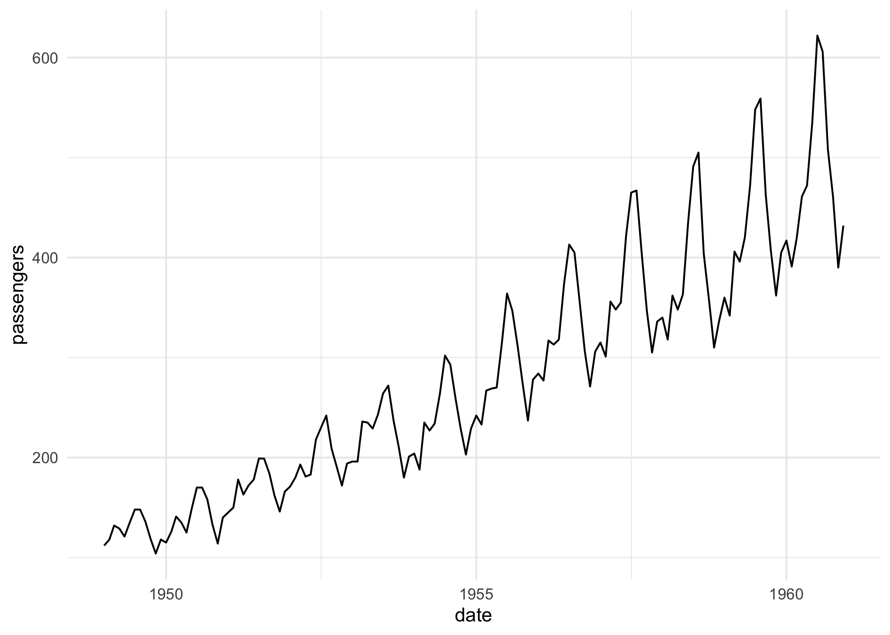

# mlr3forecast

Extending mlr3 to time series forecasting.

> This package is in an early stage of development and should be
> considered experimental. If you are interested in experimenting with
> it, we welcome your feedback!

## Installation

Install the development version from [GitHub](https://github.com/):

``` r
# install.packages("pak")
pak::pak("mlr-org/mlr3forecast")
```

## Usage

The goal of mlr3forecast is to extend mlr3 to time series forecasting.
This is achieved by introducing new classes and methods for forecasting
tasks, learners, and resamplers. For now the forecasting task and
learner is restricted to time series regression tasks, but might be
extended to classification tasks in the future.

We have two goals, one to support traditional forecasting learners and
the other to support machine learning forecasting, i.e. using regression
learners and applying them to forecasting tasks. The design of the
latter is still in flux and may change.

### Example: forecasting with forecast learner

Currently, we support native forecasting learners from the forecast and
smooth packages. In the future, we plan to support more learners.

``` r
library(mlr3forecast)
library(mlr3pipelines)

task = tsk("airpassengers")
task
#> 
#> ── <TaskFcst> (144x1): Monthly Airline Passenger Numbers 1949-1960 ─────────────
#> • Target: passengers
#> • Properties: ordered
#> • Order by: month
#> • Frequency: month

# or plot the task
autoplot(task)
```



``` r

# train a forecast learner
learner = lrn("fcst.auto_arima")$train(task)
prediction = learner$predict(task, 140:144)
prediction
#> 
#> ── <PredictionRegr> for 5 observations: ────────────────────────────────────────
#>  row_ids truth response      month
#>      140   606 623.9219 1960-08-01
#>      141   508 513.8585 1960-09-01
#>      142   461 450.7762 1960-10-01
#>      143   390 410.8961 1960-11-01
#>      144   432 439.9462 1960-12-01
prediction$score(msr("regr.rmse"))
#> regr.rmse 
#>  13.85518

# generate new data to forecast unseen data
newdata = generate_newdata(task, 12L)
head(newdata)
#>         month passengers
#> 1: 1961-01-01         NA
#> 2: 1961-02-01         NA
#> 3: 1961-03-01         NA
#> 4: 1961-04-01         NA
#> 5: 1961-05-01         NA
#> 6: 1961-06-01         NA
prediction = learner$predict_newdata(newdata, task)
prediction
#> 
#> ── <PredictionRegr> for 12 observations: ───────────────────────────────────────
#>  row_ids truth response      month
#>        1    NA 445.6351 1961-01-01
#>        2    NA 420.3953 1961-02-01
#>        3    NA 449.1988 1961-03-01
#>      ---   ---      ---        ---
#>       10    NA 494.1275 1961-10-01
#>       11    NA 423.3336 1961-11-01
#>       12    NA 465.5085 1961-12-01

# add a target log transformation
learner = as_learner(ppl(
  "targettrafo",
  graph = lrn("fcst.auto_arima"),
  targetmutate.trafo = function(x) log(x),
  targetmutate.inverter = function(x) list(response = exp(x$response))
))
prediction = learner$train(task)$predict(task, 140:144)
prediction$score(msr("regr.rmse"))
#> regr.rmse 
#>  12.29896

# works with quantile response
learner = lrn(
  "fcst.auto_arima",
  predict_type = "quantiles",
  quantiles = c(0.1, 0.15, 0.5, 0.85, 0.9),
  quantile_response = 0.5
)$train(task)
learner$predict_newdata(newdata, task)
#> 
#> ── <PredictionRegr> for 12 observations: ───────────────────────────────────────
#>  row_ids truth     q0.1    q0.15     q0.5    q0.85     q0.9 response      month
#>        1    NA 430.8905 433.7106 445.6351 457.5595 460.3796 445.6351 1961-01-01
#>        2    NA 403.0907 406.4005 420.3953 434.3901 437.6999 420.3953 1961-02-01
#>        3    NA 429.7726 433.4882 449.1988 464.9093 468.6249 449.1988 1961-03-01
#>      ---   ---      ---      ---      ---      ---      ---      ---        ---
#>       10    NA 469.8626 474.5036 494.1275 513.7514 518.3925 494.1275 1961-10-01
#>       11    NA 398.8383 403.5234 423.3336 443.1438 447.8290 423.3336 1961-11-01
#>       12    NA 440.8230 445.5445 465.5085 485.4725 490.1940 465.5085 1961-12-01

# resampling
learner = lrn("fcst.auto_arima")
resampling = rsmp("fcst.holdout", ratio = 0.7)
rr = resample(task, learner, resampling)
rr$aggregate(msr("regr.rmse"))
#> regr.rmse 
#>   27.1211
```

### Example: forecasting with regression learner

``` r
library(mlr3learners)

task = tsk("airpassengers")
learner = lrn("regr.ranger")
flrn = as_learner_fcst(learner, lags = 1:12)$train(task)
newdata = generate_newdata(task, 12L)
prediction = flrn$predict_newdata(newdata, task)
prediction
#> 
#> ── <PredictionRegr> for 12 observations: ───────────────────────────────────────
#>  row_ids truth response      month
#>        1    NA 438.1652 1961-01-01
#>        2    NA 441.0345 1961-02-01
#>        3    NA 459.9077 1961-03-01
#>      ---   ---      ---        ---
#>       10    NA 478.0484 1961-10-01
#>       11    NA 448.1254 1961-11-01
#>       12    NA 445.3418 1961-12-01
prediction = flrn$predict(task, 140:144)
prediction
#> 
#> ── <PredictionRegr> for 5 observations: ────────────────────────────────────────
#>  row_ids truth response      month
#>      140   606 576.9714 1960-08-01
#>      141   508 499.5404 1960-09-01
#>      142   461 451.9052 1960-10-01
#>      143   390 417.9639 1960-11-01
#>      144   432 436.8201 1960-12-01
prediction$score(msr("regr.rmse"))
#> regr.rmse 
#>    18.985

flrn = as_learner_fcst(learner, lags = 1:12)
resampling = rsmp("fcst.holdout", ratio = 0.9)
rr = resample(task, flrn, resampling)
rr$aggregate(msr("regr.rmse"))
#> regr.rmse 
#>   46.9633

resampling = rsmp("fcst.cv")
rr = resample(task, flrn, resampling)
rr$aggregate(msr("regr.rmse"))
#> regr.rmse 
#>  26.62801
```

Or with some feature engineering using mlr3pipelines:

``` r
library(mlr3pipelines)

graph = po(
  "datefeatures",
  param_vals = list(
    week_of_year = FALSE,
    day_of_year = FALSE,
    day_of_month = FALSE,
    day_of_week = FALSE
  )
)
task = tsk("airpassengers")
task$set_col_roles("month", add = "feature")
flrn = as_learner_fcst(lrn("regr.ranger"), lags = 1:12)
glrn = as_learner(graph %>>% flrn)$train(task)
prediction = glrn$predict(task, 142:144)
prediction$score(msr("regr.rmse"))
#> regr.rmse 
#>  15.81167
```

### Example: forecasting electricity demand

``` r
library(mlr3learners)
library(mlr3pipelines)

task = tsk("electricity")
task$set_col_roles("date", add = "feature")
graph = po("datefeatures", param_vals = list(year = FALSE))
flrn = as_learner_fcst(lrn("regr.ranger"), 1:3)
glrn = as_learner(graph %>>% flrn)$train(task)

max_date = task$data()[.N, date]
newdata = data.table(
  date = max_date + 1:14,
  demand = rep(NA_real_, 14L),
  temperature = 26,
  holiday = c(TRUE, rep(FALSE, 13L))
)
prediction = glrn$predict_newdata(newdata, task)
prediction
#> 
#> ── <PredictionRegr> for 14 observations: ───────────────────────────────────────
#>  row_ids truth response       date
#>        1    NA 188692.4 2015-01-01
#>        2    NA 197250.6 2015-01-02
#>        3    NA 189536.3 2015-01-03
#>      ---   ---      ---        ---
#>       12    NA 222919.5 2015-01-12
#>       13    NA 228084.7 2015-01-13
#>       14    NA 228822.6 2015-01-14
```

### Example: global forecasting

``` r
library(mlr3learners)
library(mlr3pipelines)
library(tsibble)

dt = setDT(tsibbledata::aus_livestock)
setnames(dt, tolower)
dt[, month := as.Date(month)]
dt = dt[, .(count = sum(count)), by = .(state, month)]
setorder(dt, state, month)
task = as_task_fcst(dt, id = "aus_livestock", target = "count", order = "month", key = "state", freq = "month")
task$set_col_roles("month", add = "feature")

graph = po(
  "datefeatures",
  param_vals = list(
    week_of_year = FALSE,
    day_of_week = FALSE,
    day_of_month = FALSE,
    day_of_year = FALSE
  )
)

flrn = as_learner_fcst(lrn("regr.ranger"), 1:12)
glrn = as_learner(graph %>>% flrn)$train(task)
prediction = glrn$predict(task, 4460:4464)
prediction$score(msr("regr.rmse"))
#> regr.rmse 
#>  23781.84

resampling = rsmp("fcst.holdout", ratio = 0.9)
rr = resample(task, glrn, resampling)
rr$aggregate(msr("regr.rmse"))
#> regr.rmse 
#>  110100.7
```

### Example: global vs local forecasting

In machine learning forecasting the difference between forecasting a
time series and longitudinal data is often referred to local and global
forecasting.

``` r
retail = setDT(tsibbledata::aus_retail)
setnames(retail, tolower)
retail[, month := as.Date(month)]
vic = retail[state == "Victoria"]
vic[, let(state = NULL, `series id` = NULL)]
vic_train = vic[month < as.Date("2015-01-01")]
vic_test = vic[month >= as.Date("2015-01-01")]

# global forecasting
task_train = as_task_fcst(
  vic_train,
  id = "aus_retail_vic",
  target = "turnover",
  order = "month",
  key = "industry",
  freq = "month"
)
task_test = as_task_fcst(
  vic_test,
  id = "aus_retail_vic",
  target = "turnover",
  order = "month",
  key = "industry",
  freq = "month"
)

learner = lrn("regr.ranger")
flrn = as_learner_fcst(learner, lags = 1:12)$train(task_train)
prediction_global = flrn$predict(task_test)
prediction_global
prediction_global$score(msr("regr.rmse"))

# local forecasting
prediction_local = map(split(vic, by = "industry", drop = TRUE), function(dt) {
  task_train = as_task_fcst(
    dt[month < as.Date("2015-01-01")],
    id = "aus_retail_vic_local",
    target = "turnover",
    order = "month",
    freq = "month"
  )
  task_test = as_task_fcst(
    dt[month >= as.Date("2015-01-01")],
    id = "aus_retail_vic_local",
    target = "turnover",
    order = "month",
    freq = "month"
  )
  flrn = as_learner_fcst(learner, lags = 1:12)$train(task_train)
  prediction = flrn$predict(task_test)
  prediction
})
do.call(c, prediction_local)$score(msr("regr.rmse"))
```

### Example: Custom PipeOps

``` r
library(mlr3learners)
library(mlr3pipelines)

task = tsk("airpassengers")
pop = po("fcst.lags", lags = 1:12)
new_task = pop$train(list(task))[[1L]]
new_task$data()

task = tsk("airpassengers")
graph = po("fcst.lags", lags = 1:12) %>>%
  po(
    "datefeatures",
    param_vals = list(
      week_of_year = FALSE,
      day_of_week = FALSE,
      day_of_month = FALSE,
      day_of_year = FALSE
    )
  )
flrn = ForecastLearnerManual$new(lrn("regr.ranger"))
glrn = as_learner(graph %>>% flrn)$train(task)
prediction = glrn$predict(task, 1:12)
prediction$score(msr("regr.rmse"))

newdata = generate_newdata(task, 12L)
glrn$predict_newdata(newdata, task)
```

``` r
graph = po("fcst.lags", lags = 1:12) %>>%
  po(
    "datefeatures",
    param_vals = list(
      week_of_year = FALSE,
      day_of_week = FALSE,
      day_of_month = FALSE,
      day_of_year = FALSE
    )
  )

task = tsk("airpassengers")
flrn = ForecastLearnerManual$new(lrn("regr.ranger"))
glrn = as_learner(graph %>>% flrn)
trafo = po("fcst.targetdiff", lags = 12L)
pipeline = ppl("targettrafo", graph = glrn, trafo_pipeop = trafo)
glrn = as_learner(pipeline)$train(task)
prediction = glrn$predict(task, 142:144)
prediction$score(msr("regr.rmse"))
```
